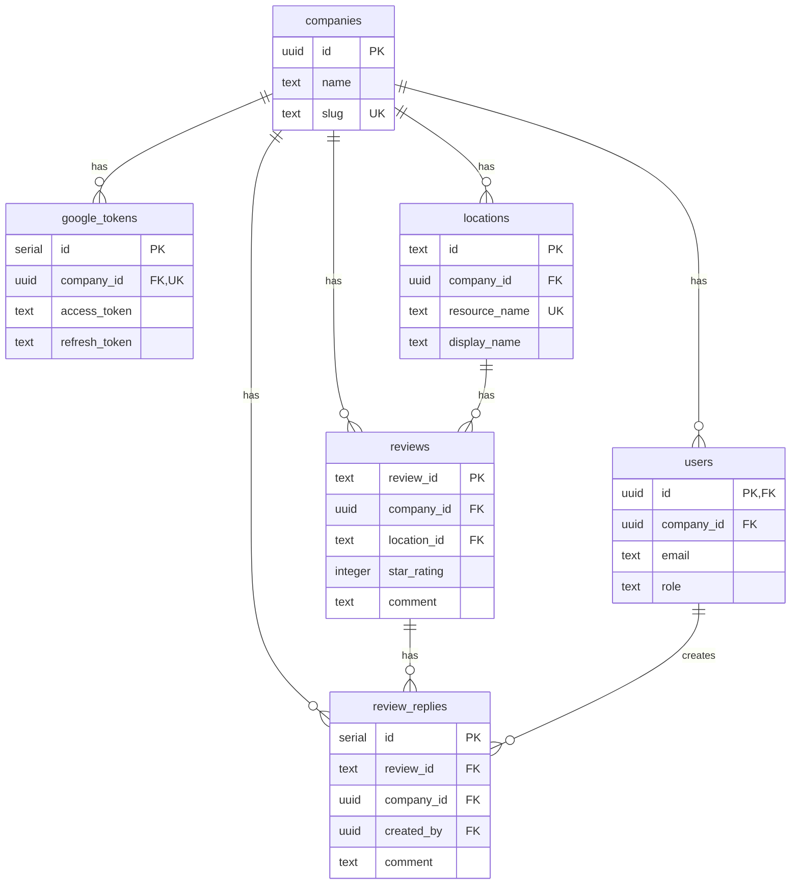

# 🏢 マルチテナント設計 - 会社ごとのログイン

## 🎯 要件

### ビジネス要件

- **会社A**のユーザー → 会社Aの店舗のみ閲覧・管理
- **会社B**のユーザー → 会社Bの店舗のみ閲覧・管理
- 会社ごとに独立したGoogle My Businessアカウント
- ログイン認証によるアクセス制御

### 技術要件

- Supabase Authでユーザー認証
- Row Level Security (RLS)でデータ分離
- 会社（テナント）ごとのデータ管理

---

## 📊 データベース設計

### 1. `companies`テーブル（新規）

```sql
CREATE TABLE companies (
  id UUID PRIMARY KEY DEFAULT uuid_generate_v4(),
  name TEXT NOT NULL,                      -- 会社名
  slug TEXT UNIQUE NOT NULL,               -- URLスラッグ (例: starbucks-japan)
  created_at TIMESTAMPTZ DEFAULT NOW(),
  updated_at TIMESTAMPTZ DEFAULT NOW()
);

-- インデックス
CREATE INDEX idx_companies_slug ON companies(slug);
```

**用途**: 会社（テナント）の基本情報

---

### 2. `users`テーブル（Supabase Auth連携）

```sql
-- Supabaseのauth.usersテーブルは既に存在
-- public.usersテーブルで追加情報を管理

CREATE TABLE users (
  id UUID PRIMARY KEY REFERENCES auth.users(id) ON DELETE CASCADE,
  company_id UUID NOT NULL REFERENCES companies(id) ON DELETE CASCADE,
  email TEXT NOT NULL,
  display_name TEXT,
  role TEXT NOT NULL DEFAULT 'member',    -- admin, member, viewer
  created_at TIMESTAMPTZ DEFAULT NOW(),
  updated_at TIMESTAMPTZ DEFAULT NOW()
);

-- インデックス
CREATE INDEX idx_users_company_id ON users(company_id);
CREATE INDEX idx_users_email ON users(email);
```

**ロール定義**:

- `admin`: 会社内の全権限（ユーザー管理、店舗管理、返信送信）
- `member`: レビュー閲覧、返信作成（送信はadminが承認）
- `viewer`: レビュー閲覧のみ

---

### 3. `google_tokens`テーブル（改修）

```sql
-- 現在: 単一レコード（id=1）
-- 改修後: 会社ごとにトークンを管理

CREATE TABLE google_tokens (
  id SERIAL PRIMARY KEY,
  company_id UUID NOT NULL REFERENCES companies(id) ON DELETE CASCADE,
  access_token TEXT NOT NULL,
  refresh_token TEXT NOT NULL,
  expires_at TIMESTAMPTZ,
  updated_at TIMESTAMPTZ DEFAULT NOW(),
  UNIQUE(company_id)  -- 1会社につき1トークン
);

-- インデックス
CREATE INDEX idx_google_tokens_company_id ON google_tokens(company_id);
```

---

### 4. `locations`テーブル（改修）

```sql
CREATE TABLE locations (
  id TEXT PRIMARY KEY,                    -- Google Location ID
  company_id UUID NOT NULL REFERENCES companies(id) ON DELETE CASCADE,
  resource_name TEXT UNIQUE NOT NULL,
  display_name TEXT NOT NULL,
  address TEXT,
  phone TEXT,
  website_url TEXT,
  created_at TIMESTAMPTZ DEFAULT NOW(),
  updated_at TIMESTAMPTZ DEFAULT NOW()
);

-- インデックス
CREATE INDEX idx_locations_company_id ON locations(company_id);
```

---

### 5. `reviews`テーブル（改修）

```sql
-- location_idからcompany_idを参照できるので、直接追加しなくてもOK
-- ただし、パフォーマンスのため追加を推奨

CREATE TABLE reviews (
  review_id TEXT PRIMARY KEY,
  company_id UUID NOT NULL REFERENCES companies(id) ON DELETE CASCADE,
  location_id TEXT NOT NULL REFERENCES locations(id) ON DELETE CASCADE,
  resource_name TEXT UNIQUE NOT NULL,
  star_rating INTEGER,
  comment TEXT,
  create_time TIMESTAMPTZ NOT NULL,
  update_time TIMESTAMPTZ NOT NULL,
  reviewer_display_name TEXT NOT NULL,
  reviewer_profile_photo_url TEXT,
  taste_score INTEGER,
  service_score INTEGER,
  price_score INTEGER,
  location_score INTEGER,
  hygiene_score INTEGER
);

-- インデックス
CREATE INDEX idx_reviews_company_id ON reviews(company_id);
CREATE INDEX idx_reviews_location_id ON reviews(location_id);
```

---

### 6. `review_replies`テーブル（改修）

```sql
CREATE TABLE review_replies (
  id SERIAL PRIMARY KEY,
  review_id TEXT NOT NULL REFERENCES reviews(review_id) ON DELETE CASCADE,
  company_id UUID NOT NULL REFERENCES companies(id) ON DELETE CASCADE,
  comment TEXT NOT NULL,
  update_time TIMESTAMPTZ,
  sent_at TIMESTAMPTZ,
  created_by UUID REFERENCES users(id),  -- 誰が作成したか
  created_at TIMESTAMPTZ DEFAULT NOW()
);

-- インデックス
CREATE INDEX idx_review_replies_company_id ON review_replies(company_id);
CREATE INDEX idx_review_replies_review_id ON review_replies(review_id);
```

---

## 🔒 Row Level Security (RLS)

### RLS有効化

```sql
ALTER TABLE companies ENABLE ROW LEVEL SECURITY;
ALTER TABLE users ENABLE ROW LEVEL SECURITY;
ALTER TABLE google_tokens ENABLE ROW LEVEL SECURITY;
ALTER TABLE locations ENABLE ROW LEVEL SECURITY;
ALTER TABLE reviews ENABLE ROW LEVEL SECURITY;
ALTER TABLE review_replies ENABLE ROW LEVEL SECURITY;
```

### RLSポリシー

#### 1. `companies`テーブル

```sql
-- 自分が所属する会社のみ閲覧可能
CREATE POLICY "Users can view their own company"
  ON companies
  FOR SELECT
  USING (
    id IN (
      SELECT company_id FROM users WHERE id = auth.uid()
    )
  );
```

#### 2. `users`テーブル

```sql
-- 自分の会社のユーザーのみ閲覧可能
CREATE POLICY "Users can view company members"
  ON users
  FOR SELECT
  USING (
    company_id IN (
      SELECT company_id FROM users WHERE id = auth.uid()
    )
  );

-- adminのみ、自分の会社のユーザーを追加・編集可能
CREATE POLICY "Admins can manage company members"
  ON users
  FOR ALL
  USING (
    company_id IN (
      SELECT company_id FROM users
      WHERE id = auth.uid() AND role = 'admin'
    )
  );
```

#### 3. `locations`テーブル

```sql
-- 自分の会社の店舗のみ閲覧可能
CREATE POLICY "Users can view company locations"
  ON locations
  FOR SELECT
  USING (
    company_id IN (
      SELECT company_id FROM users WHERE id = auth.uid()
    )
  );
```

#### 4. `reviews`テーブル

```sql
-- 自分の会社のレビューのみ閲覧可能
CREATE POLICY "Users can view company reviews"
  ON reviews
  FOR SELECT
  USING (
    company_id IN (
      SELECT company_id FROM users WHERE id = auth.uid()
    )
  );
```

#### 5. `review_replies`テーブル

```sql
-- 自分の会社の返信のみ閲覧可能
CREATE POLICY "Users can view company replies"
  ON review_replies
  FOR SELECT
  USING (
    company_id IN (
      SELECT company_id FROM users WHERE id = auth.uid()
    )
  );

-- member以上は返信を作成可能
CREATE POLICY "Members can create replies"
  ON review_replies
  FOR INSERT
  WITH CHECK (
    company_id IN (
      SELECT company_id FROM users
      WHERE id = auth.uid() AND role IN ('admin', 'member')
    )
  );
```

---

## 🔐 認証フロー

### 1. ログイン

```
ユーザー
  ↓
Supabase Auth (メール/パスワード または Google OAuth)
  ↓
auth.users にユーザー作成
  ↓
public.users テーブルで company_id を紐付け
  ↓
ダッシュボードへリダイレクト
```

### 2. データアクセス

```
ユーザーがレビュー一覧にアクセス
  ↓
Supabase クライアント (RLS有効)
  ↓
SELECT * FROM reviews WHERE company_id = (ユーザーの会社ID)
  ↓
自分の会社のレビューのみ取得
```

---

## 🛠️ 実装手順

### Phase 1: データベースマイグレーション

#### 1-1. `companies`テーブル作成

```sql
-- supabase/migrations/20241127000001_create_companies.sql
CREATE TABLE companies (
  id UUID PRIMARY KEY DEFAULT uuid_generate_v4(),
  name TEXT NOT NULL,
  slug TEXT UNIQUE NOT NULL,
  created_at TIMESTAMPTZ DEFAULT NOW(),
  updated_at TIMESTAMPTZ DEFAULT NOW()
);

CREATE INDEX idx_companies_slug ON companies(slug);

ALTER TABLE companies ENABLE ROW LEVEL SECURITY;

CREATE POLICY "Users can view their own company"
  ON companies FOR SELECT
  USING (
    id IN (SELECT company_id FROM users WHERE id = auth.uid())
  );
```

#### 1-2. `users`テーブル作成

```sql
-- supabase/migrations/20241127000002_create_users.sql
CREATE TABLE users (
  id UUID PRIMARY KEY REFERENCES auth.users(id) ON DELETE CASCADE,
  company_id UUID NOT NULL REFERENCES companies(id) ON DELETE CASCADE,
  email TEXT NOT NULL,
  display_name TEXT,
  role TEXT NOT NULL DEFAULT 'member',
  created_at TIMESTAMPTZ DEFAULT NOW(),
  updated_at TIMESTAMPTZ DEFAULT NOW()
);

CREATE INDEX idx_users_company_id ON users(company_id);
CREATE INDEX idx_users_email ON users(email);

ALTER TABLE users ENABLE ROW LEVEL SECURITY;

CREATE POLICY "Users can view company members"
  ON users FOR SELECT
  USING (
    company_id IN (SELECT company_id FROM users WHERE id = auth.uid())
  );
```

#### 1-3. 既存テーブルに`company_id`追加

```sql
-- supabase/migrations/20241127000003_add_company_id_to_existing_tables.sql

-- google_tokens
ALTER TABLE google_tokens ADD COLUMN company_id UUID REFERENCES companies(id) ON DELETE CASCADE;
CREATE INDEX idx_google_tokens_company_id ON google_tokens(company_id);

-- locations
ALTER TABLE locations ADD COLUMN company_id UUID REFERENCES companies(id) ON DELETE CASCADE;
CREATE INDEX idx_locations_company_id ON locations(company_id);

-- reviews
ALTER TABLE reviews ADD COLUMN company_id UUID REFERENCES companies(id) ON DELETE CASCADE;
CREATE INDEX idx_reviews_company_id ON reviews(company_id);

-- review_replies
ALTER TABLE review_replies ADD COLUMN company_id UUID REFERENCES companies(id) ON DELETE CASCADE;
CREATE INDEX idx_review_replies_company_id ON review_replies(company_id);
```

#### 1-4. RLSポリシー設定

```sql
-- supabase/migrations/20241127000004_setup_rls_policies.sql

-- locations
ALTER TABLE locations ENABLE ROW LEVEL SECURITY;
CREATE POLICY "Users can view company locations"
  ON locations FOR SELECT
  USING (company_id IN (SELECT company_id FROM users WHERE id = auth.uid()));

-- reviews
ALTER TABLE reviews ENABLE ROW LEVEL SECURITY;
CREATE POLICY "Users can view company reviews"
  ON reviews FOR SELECT
  USING (company_id IN (SELECT company_id FROM users WHERE id = auth.uid()));

-- review_replies
ALTER TABLE review_replies ENABLE ROW LEVEL SECURITY;
CREATE POLICY "Users can view company replies"
  ON review_replies FOR SELECT
  USING (company_id IN (SELECT company_id FROM users WHERE id = auth.uid()));

CREATE POLICY "Members can create replies"
  ON review_replies FOR INSERT
  WITH CHECK (
    company_id IN (
      SELECT company_id FROM users
      WHERE id = auth.uid() AND role IN ('admin', 'member')
    )
  );
```

---

### Phase 2: 認証機能実装

#### 2-1. ログインページ作成

**`src/app/login/page.jsx`**

```javascript
"use client";
import { useState } from "react";
import { useRouter } from "next/navigation";
import { supabase } from "@/lib/supabase";
import {
  Box,
  Paper,
  TextField,
  Button,
  Typography,
  Alert,
} from "@mui/material";

export default function LoginPage() {
  const [email, setEmail] = useState("");
  const [password, setPassword] = useState("");
  const [error, setError] = useState("");
  const [loading, setLoading] = useState(false);
  const router = useRouter();

  const handleLogin = async (e) => {
    e.preventDefault();
    setError("");
    setLoading(true);

    try {
      const { data, error } = await supabase.auth.signInWithPassword({
        email,
        password,
      });

      if (error) throw error;

      // ログイン成功
      router.push("/");
    } catch (err) {
      setError(err.message || "ログインに失敗しました");
    } finally {
      setLoading(false);
    }
  };

  return (
    <Box
      sx={{
        display: "flex",
        alignItems: "center",
        justifyContent: "center",
        minHeight: "100vh",
        bgcolor: "background.default",
      }}
    >
      <Paper
        elevation={3}
        sx={{
          p: 4,
          maxWidth: 400,
          width: "100%",
        }}
      >
        <Typography variant="h4" gutterBottom align="center">
          GMB Review
        </Typography>
        <Typography
          variant="body2"
          color="text.secondary"
          gutterBottom
          align="center"
        >
          口コミ管理システム
        </Typography>

        {error && (
          <Alert severity="error" sx={{ mt: 2, mb: 2 }}>
            {error}
          </Alert>
        )}

        <form onSubmit={handleLogin}>
          <TextField
            fullWidth
            label="メールアドレス"
            type="email"
            value={email}
            onChange={(e) => setEmail(e.target.value)}
            margin="normal"
            required
          />
          <TextField
            fullWidth
            label="パスワード"
            type="password"
            value={password}
            onChange={(e) => setPassword(e.target.value)}
            margin="normal"
            required
          />
          <Button
            fullWidth
            type="submit"
            variant="contained"
            disabled={loading}
            sx={{ mt: 3 }}
          >
            {loading ? "ログイン中..." : "ログイン"}
          </Button>
        </form>
      </Paper>
    </Box>
  );
}
```

#### 2-2. 認証コンテキスト作成

**`src/lib/contexts/AuthContext.jsx`**

```javascript
"use client";
import { createContext, useContext, useState, useEffect } from "react";
import { useRouter } from "next/navigation";
import { supabase } from "@/lib/supabase";

const AuthContext = createContext();

export function AuthProvider({ children }) {
  const [user, setUser] = useState(null);
  const [companyId, setCompanyId] = useState(null);
  const [loading, setLoading] = useState(true);
  const router = useRouter();

  useEffect(() => {
    // 初回ロード時のセッション確認
    supabase.auth.getSession().then(({ data: { session } }) => {
      if (session) {
        setUser(session.user);
        fetchUserProfile(session.user.id);
      } else {
        setLoading(false);
      }
    });

    // 認証状態の変更を監視
    const {
      data: { subscription },
    } = supabase.auth.onAuthStateChange((event, session) => {
      if (session) {
        setUser(session.user);
        fetchUserProfile(session.user.id);
      } else {
        setUser(null);
        setCompanyId(null);
        setLoading(false);
      }
    });

    return () => subscription.unsubscribe();
  }, []);

  const fetchUserProfile = async (userId) => {
    try {
      const { data, error } = await supabase
        .from("users")
        .select("company_id, role, display_name")
        .eq("id", userId)
        .single();

      if (error) throw error;

      setCompanyId(data.company_id);
    } catch (error) {
      console.error("Error fetching user profile:", error);
    } finally {
      setLoading(false);
    }
  };

  const signOut = async () => {
    await supabase.auth.signOut();
    router.push("/login");
  };

  return (
    <AuthContext.Provider
      value={{
        user,
        companyId,
        loading,
        signOut,
      }}
    >
      {children}
    </AuthContext.Provider>
  );
}

export function useAuth() {
  return useContext(AuthContext);
}
```

#### 2-3. 認証ガード追加

**`src/components/auth/AuthGuard.jsx`**

```javascript
"use client";
import { useEffect } from "react";
import { useRouter, usePathname } from "next/navigation";
import { useAuth } from "@/lib/contexts/AuthContext";
import { Box, CircularProgress } from "@mui/material";

export default function AuthGuard({ children }) {
  const { user, loading } = useAuth();
  const router = useRouter();
  const pathname = usePathname();

  useEffect(() => {
    if (!loading && !user && pathname !== "/login") {
      router.push("/login");
    }
  }, [user, loading, pathname, router]);

  if (loading) {
    return (
      <Box
        sx={{
          display: "flex",
          alignItems: "center",
          justifyContent: "center",
          minHeight: "100vh",
        }}
      >
        <CircularProgress />
      </Box>
    );
  }

  if (!user && pathname !== "/login") {
    return null;
  }

  return <>{children}</>;
}
```

---

### Phase 3: API修正（company_id対応）

#### 3-1. Supabaseクライアント修正

**`src/lib/supabase.js`**（既存）

```javascript
// クライアントサイド: RLS有効（自動的にcompany_idでフィルター）
import { createClient } from "@supabase/supabase-js";

export const supabase = createClient(
  process.env.NEXT_PUBLIC_SUPABASE_URL,
  process.env.NEXT_PUBLIC_SUPABASE_ANON_KEY
);
```

**`src/lib/supabaseAdmin.js`**（既存）

```javascript
// サーバーサイド: Service Role（RLSをバイパス、手動でcompany_idフィルター）
import { createClient } from "@supabase/supabase-js";

export const supabaseAdmin = createClient(
  process.env.NEXT_PUBLIC_SUPABASE_URL,
  process.env.SUPABASE_SERVICE_ROLE_KEY,
  {
    auth: {
      autoRefreshToken: false,
      persistSession: false,
    },
  }
);
```

#### 3-2. `/api/reviews/route.js`修正

```javascript
export async function GET(request) {
  const { searchParams } = new URL(request.url);

  // ユーザーのcompany_idを取得
  const {
    data: { user },
  } = await supabase.auth.getUser();
  if (!user) {
    return new Response(JSON.stringify({ error: "Unauthorized" }), {
      status: 401,
    });
  }

  const { data: userData } = await supabase
    .from("users")
    .select("company_id")
    .eq("id", user.id)
    .single();

  if (!userData) {
    return new Response(JSON.stringify({ error: "User not found" }), {
      status: 404,
    });
  }

  const companyId = userData.company_id;

  // 自分の会社のレビューのみ取得（RLSが自動的にフィルター）
  let query = supabase.from("reviews").select("*").eq("company_id", companyId);

  // ... 既存のクエリ
}
```

---

## 📊 ERD（Entity Relationship Diagram）



---

## ✅ 実装チェックリスト

### データベース

- [ ] `companies`テーブル作成
- [ ] `users`テーブル作成
- [ ] 既存テーブルに`company_id`追加
- [ ] RLSポリシー設定
- [ ] テストデータ投入（会社2社、ユーザー各3名）

### 認証

- [ ] ログインページ作成
- [ ] `AuthContext`作成
- [ ] `AuthGuard`作成
- [ ] `layout.jsx`に`AuthProvider`と`AuthGuard`追加
- [ ] Sidebarにログアウトボタン追加

### API

- [ ] `/api/reviews`にcompany_idフィルター追加
- [ ] `/api/reviews/sync`にcompany_id対応
- [ ] `/api/reviews/stats`にcompany_idフィルター追加
- [ ] `/api/replies/generate`にcompany_id対応

### テスト

- [ ] 会社Aでログイン → 会社Aのデータのみ表示
- [ ] 会社Bでログイン → 会社Bのデータのみ表示
- [ ] ログアウト → ログインページへリダイレクト

---

## 🚀 段階的リリース

### ステップ1: DB準備（ユーザーには見えない）

- マイグレーション実行
- RLS設定
- テストデータ投入

### ステップ2: 認証機能追加

- ログインページ
- 認証ガード

### ステップ3: API修正

- company_idフィルター
- RLS動作確認

### ステップ4: 本番展開

- 既存ユーザーをcompaniesテーブルに移行
- 本番環境でテスト
