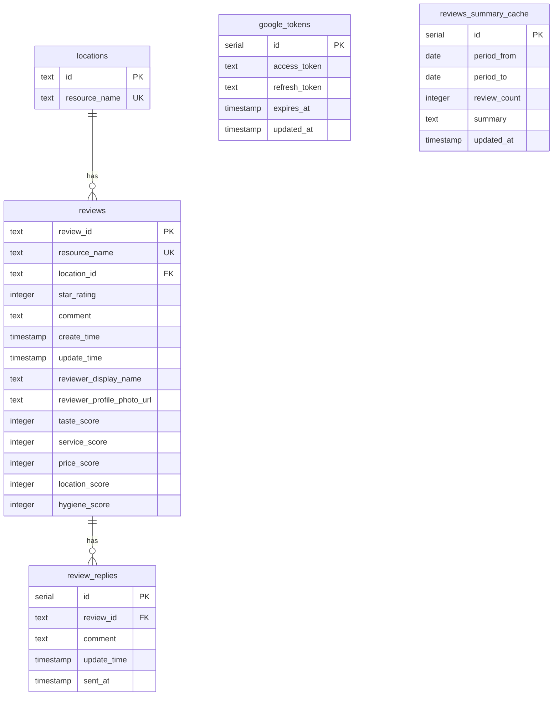

# データベース設計書

## テーブル定義

### google_tokens（Google認証情報）

```sql
create table public.google_tokens (
  id serial not null,
  access_token text not null,
  refresh_token text not null,
  expires_at timestamp with time zone not null,
  updated_at timestamp with time zone not null default now(),
  constraint google_tokens_pkey primary key (id)
) TABLESPACE pg_default;
```

#### カラム説明

| カラム名      | 型                       | NULL     | デフォルト | 説明                     |
| ------------- | ------------------------ | -------- | ---------- | ------------------------ |
| id            | serial                   | NOT NULL | -          | 一意識別子（PK）         |
| access_token  | text                     | NOT NULL | -          | Googleアクセストークン   |
| refresh_token | text                     | NOT NULL | -          | リフレッシュトークン     |
| expires_at    | timestamp with time zone | NOT NULL | -          | アクセストークン有効期限 |
| updated_at    | timestamp with time zone | NOT NULL | now()      | 更新日時                 |

### locations（店舗情報）

```sql
create table public.locations (
  id text not null,
  resource_name text not null,
  constraint locations_pkey primary key (id),
  constraint locations_resource_name_key unique (resource_name)
) TABLESPACE pg_default;
```

#### カラム説明

| カラム名      | 型   | NULL     | デフォルト | 説明                   |
| ------------- | ---- | -------- | ---------- | ---------------------- |
| id            | text | NOT NULL | -          | 店舗ID（PK）           |
| resource_name | text | NOT NULL | -          | Googleリソース名（UK） |

### reviews（レビュー情報）

```sql
create table public.reviews (
  review_id text not null,
  resource_name text not null,
  location_id text not null,
  star_rating integer null,
  comment text null,
  create_time timestamp with time zone not null,
  update_time timestamp with time zone not null,
  reviewer_display_name text not null,
  reviewer_profile_photo_url text null,
  taste_score integer null,
  service_score integer null,
  price_score integer null,
  location_score integer null,
  hygiene_score integer null,
  constraint reviews_pkey primary key (review_id),
  constraint reviews_resource_name_key unique (resource_name),
  constraint reviews_location_id_fkey foreign key (location_id) references locations (id)
) TABLESPACE pg_default;
```

#### カラム説明

| カラム名                   | 型                       | NULL     | デフォルト | 説明                          |
| -------------------------- | ------------------------ | -------- | ---------- | ----------------------------- |
| review_id                  | text                     | NOT NULL | -          | レビューID（PK）              |
| resource_name              | text                     | NOT NULL | -          | Googleリソース名（UK）        |
| location_id                | text                     | NOT NULL | -          | 店舗ID（FK）                  |
| star_rating                | integer                  | NULL     | -          | 星評価（1-5）                 |
| comment                    | text                     | NULL     | -          | レビューコメント              |
| create_time                | timestamp with time zone | NOT NULL | -          | 作成日時                      |
| update_time                | timestamp with time zone | NOT NULL | -          | 更新日時                      |
| reviewer_display_name      | text                     | NOT NULL | -          | レビュアー表示名              |
| reviewer_profile_photo_url | text                     | NULL     | -          | レビュアープロフィール画像URL |
| taste_score                | integer                  | NULL     | -          | 味の評価（0-5）               |
| service_score              | integer                  | NULL     | -          | サービスの評価（0-5）         |
| price_score                | integer                  | NULL     | -          | 価格の評価（0-5）             |
| location_score             | integer                  | NULL     | -          | 立地の評価（0-5）             |
| hygiene_score              | integer                  | NULL     | -          | 衛生の評価（0-5）             |

### review_replies（返信情報）

```sql
create table public.review_replies (
  review_id text not null,
  comment text not null,
  update_time timestamp with time zone not null,
  id serial not null,
  sent_at timestamp with time zone null,
  constraint review_replies_pkey primary key (id),
  constraint review_replies_review_id_fkey foreign key (review_id) references reviews (review_id)
) TABLESPACE pg_default;
```

#### カラム説明

| カラム名    | 型                       | NULL     | デフォルト | 説明             |
| ----------- | ------------------------ | -------- | ---------- | ---------------- |
| id          | serial                   | NOT NULL | -          | 一意識別子（PK） |
| review_id   | text                     | NOT NULL | -          | レビューID（FK） |
| comment     | text                     | NOT NULL | -          | 返信内容         |
| update_time | timestamp with time zone | NOT NULL | -          | 更新日時         |
| sent_at     | timestamp with time zone | NULL     | -          | Google送信日時   |

### reviews_summary_cache（レビューサマリーキャッシュ）

```sql
create table public.reviews_summary_cache (
  id serial not null,
  period_from date null,
  period_to date null,
  review_count integer not null,
  summary text not null,
  updated_at timestamp with time zone not null default now(),
  constraint reviews_summary_cache_pkey primary key (id)
) TABLESPACE pg_default;

create unique index if not exists reviews_summary_cache_period_review_count_idx
  on public.reviews_summary_cache
  using btree (period_from, period_to, review_count)
  tablespace pg_default;
```

#### カラム説明

| カラム名     | 型                       | NULL     | デフォルト | 説明             |
| ------------ | ------------------------ | -------- | ---------- | ---------------- |
| id           | serial                   | NOT NULL | -          | 一意識別子（PK） |
| period_from  | date                     | NULL     | -          | 集計期間開始日   |
| period_to    | date                     | NULL     | -          | 集計期間終了日   |
| review_count | integer                  | NOT NULL | -          | レビュー数       |
| summary      | text                     | NOT NULL | -          | サマリー内容     |
| updated_at   | timestamp with time zone | NOT NULL | now()      | 更新日時         |

## テーブル関連図



## インデックス

### google_tokens

```sql
CREATE INDEX idx_google_tokens_updated_at ON public.google_tokens(updated_at DESC);
```
