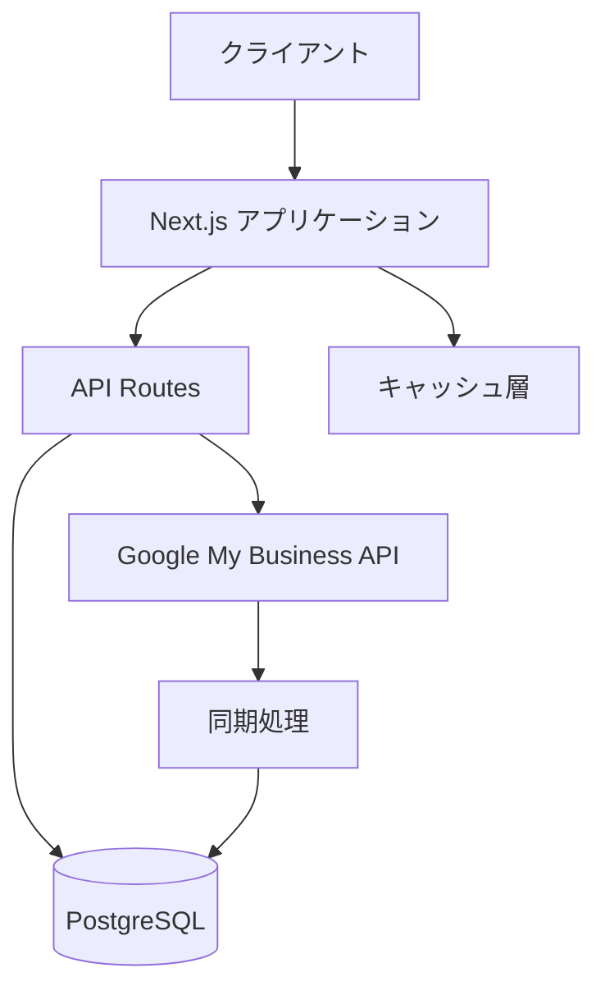

# GMBレビュー管理アプリケーション

## プロジェクト概要

GMBレビュー管理アプリケーションは、Google My Business（GMB）のレビューを効率的に管理し、分析するためのWebアプリケーションです。店舗オーナーやマネージャーが、顧客からのフィードバックを一元管理し、適切に対応するためのツールを提供します。

### 主な機能

1. レビュー管理

   - GMBからのレビュー自動同期
   - レビュー一覧表示とフィルタリング
   - レビューへの返信管理
   - 返信テンプレート機能

2. 分析機能

   - レビュースコアの集計・分析
   - トレンド分析
   - センチメント分析
   - キーワード抽出

3. ダッシュボード

   - 全体統計情報
   - 評価分布
   - 返信率
   - 最近のレビュー

4. 通知機能
   - 新規レビュー通知
   - 重要レビューのアラート
   - 定期レポート

## 技術スタック

### フロントエンド

- Next.js 14
- React
- TypeScript
- TailwindCSS
- Shadcn/ui
- React Query

### バックエンド

- Next.js API Routes
- Node.js
- TypeScript
- PostgreSQL
- Prisma ORM

### インフラストラクチャ

- Vercel（ホスティング）
- Supabase（データベース）
- Google Cloud Platform
  - Google My Business API
  - Cloud Functions
  - Cloud Scheduler

### 開発ツール

- ESLint
- Prettier
- Jest
- React Testing Library
- Husky
- GitHub Actions

## システムアーキテクチャ

### 全体構成

### データフロー

1. レビュー同期

   - Cloud Schedulerによる定期実行
   - GMB APIからのデータ取得
   - データベースへの保存/更新

2. レビュー管理

   - フロントエンドからのリクエスト
   - APIルートでの処理
   - データベースとの連携

3. 分析処理
   - バッチ処理による集計
   - リアルタイム分析
   - キャッシュの活用

## データベース設計

### テーブル構成

1. google_tokens

   - Google認証情報の管理
   - アクセストークン
   - リフレッシュトークン

2. reviews

   - レビュー情報
   - 評価スコア
   - コメント
   - メタデータ

3. review_replies
   - 返信情報
   - 返信内容
   - 送信状態

## セキュリティ

### 認証・認可

- Google OAuth 2.0
- JWTトークン
- RBAC（Role-Based Access Control）

### データ保護

- データ暗号化
- セキュアなAPI通信
- アクセス制御

## パフォーマンス最適化

### フロントエンド

- SSR/SSG の活用
- 画像最適化
- コード分割

### バックエンド

- キャッシュ戦略
- クエリ最適化
- N+1問題の解決

### データベース

- インデックス設計
- クエリチューニング
- コネクションプール

## 監視・ロギング

### アプリケーション監視

- エラー追跡
- パフォーマンスメトリクス
- ユーザー行動分析

### インフラ監視

- リソース使用率
- レスポンスタイム
- エラーレート

## デプロイメント

### CI/CD

- GitHub Actions
- 自動テスト
- 自動デプロイ

### 環境

- 開発環境
- ステージング環境
- 本番環境

## 開発プロセス

### バージョン管理

- Git
- GitHub
- ブランチ戦略

### コードレビュー

- PRテンプレート
- レビューガイドライン
- 自動チェック

### テスト

- ユニットテスト
- 統合テスト
- E2Eテスト

## 今後の展開

### 機能拡張

- AIによる返信提案
- 競合分析
- 多言語対応

### インフラ改善

- スケーラビリティ向上
- 可用性強化
- パフォーマンス最適化

## 運用・保守

### バックアップ

- データベースバックアップ
- 設定ファイルバックアップ
- リストア手順

### メンテナンス

- 定期アップデート
- セキュリティパッチ
- パフォーマンスチューニング

### サポート

- ユーザーサポート
- 技術サポート
- ドキュメント管理

## 改善ポイント（2024年3月時点）

### APIエンドポイントの整理

以下のエンドポイントで機能の重複が見られます：

- `/api/reviews/stats/route.js`
- `/api/reviews/stats/response/route.js`
- `/api/dashboard/stats/route.js`

これらは以下の統計情報を重複して計算しています：

- 総レビュー数
- 返信率
- 平均返信時間

将来的なリファクタリングの際に、これらのエンドポイントの統合を検討することで、
コードの保守性向上とパフォーマンスの最適化が期待できます。

### キャッシュ戦略の改善案

`reviews_summary_cache`テーブルの活用方法について：

- キャッシュエントリーの有効期限設定の追加
- より細かい粒度でのキャッシュ管理の実装
- キャッシュ更新戦略の最適化

### データベース構造

現状のテーブル構成は適切に設計されており、各テーブルも有効に活用されています：

- `google_tokens`: OAuth認証トークン管理
- `locations`: 店舗情報の管理
- `reviews`: レビュー情報の保存と分析
- `review_replies`: レビューへの返信管理
- `reviews_summary_cache`: レビューサマリーのキャッシュ

大きな構造変更は必要ありませんが、以下の点は継続的にモニタリングが必要です：

- インデックスの使用状況と最適化
- クエリパフォーマンス
- データ増加に伴うスケーラビリティ
